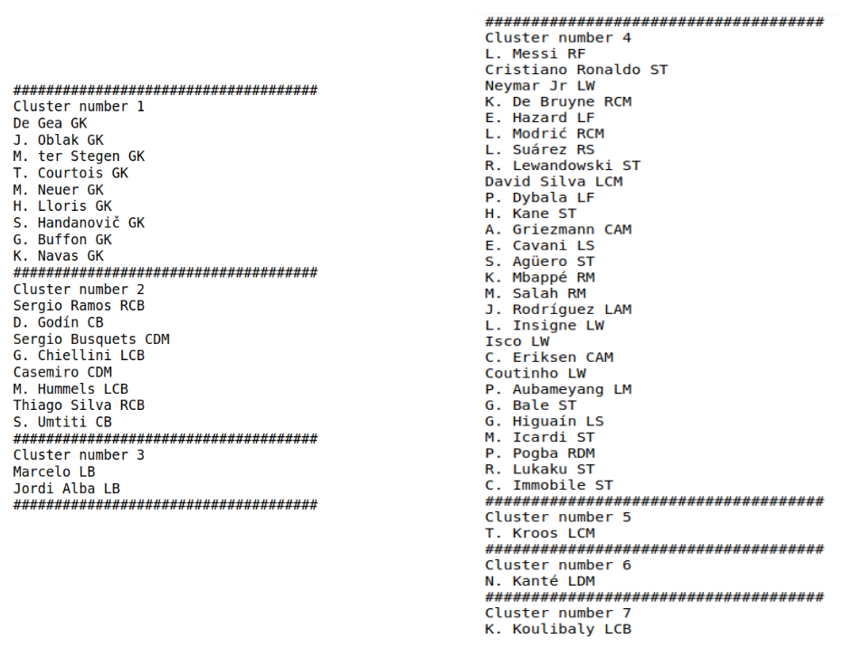
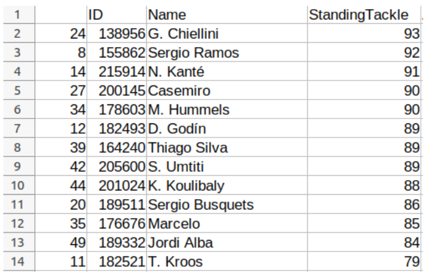
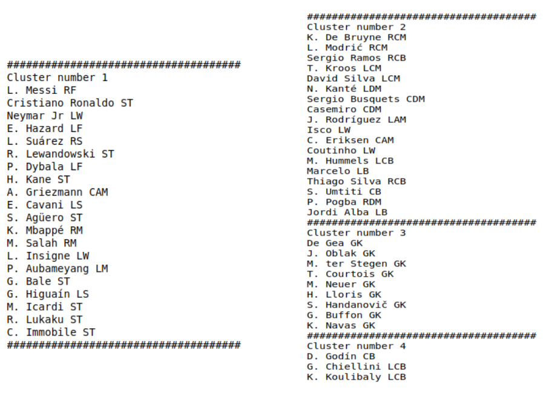
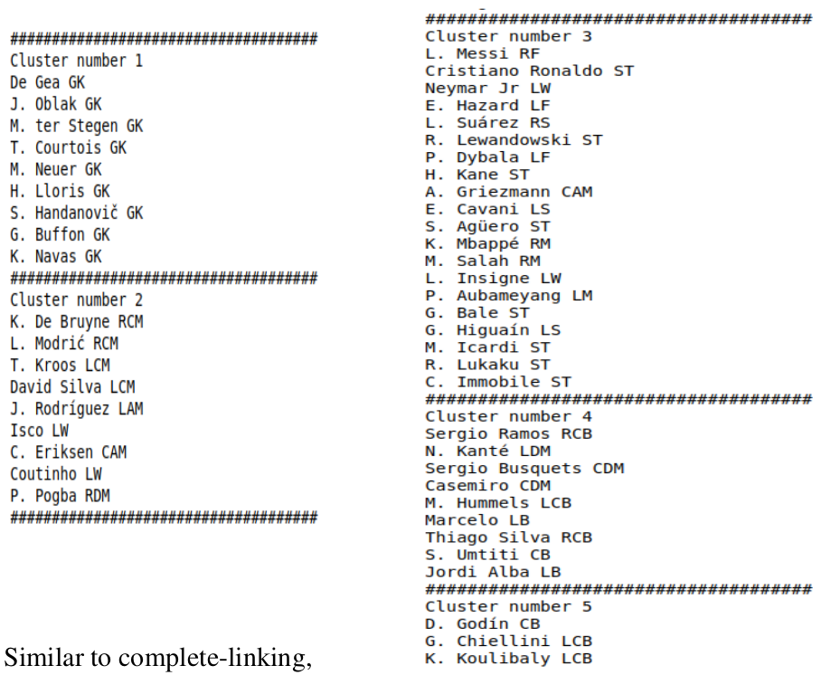
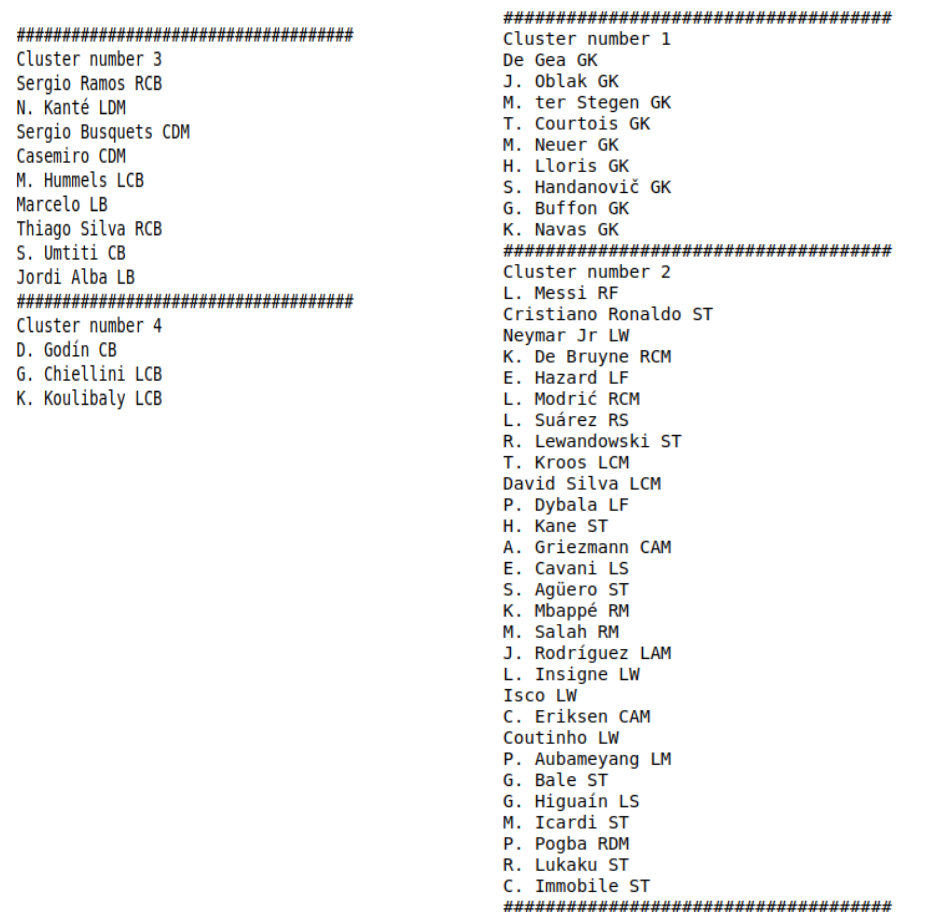

# Hierarchical Clustering – Analysis

The top 50 (rating wise) footballers are chosen for the analysis tokeep the insights more focussed.

On running our Single-Linkage clustering algorithm with a reasonable threshold, we obtain the following 7 clusters.

All the players in the first cluster belong to the same position – GK.

The players in Cluster number 2 are all centre-backs, with the exception of Sergio Busquets and Casemiro.

This is explained by the above. When we graph the players with respect to
the factor most attributed to defenders, the standing tackle. Casemiro and
Busquets are the only midfielders with a standing tackle value among the
defenders, and are thus placed in Cluster 2.

Marcelo and Jordi Alba are the only full backs in the top 50, and thus have
a separate cluster, cluster number 3.

Cluster number 4 consists of the attacking players as can be seen, who
appear to make the majority of the top 50.

We can however see some outliers, three players who have clusters all for
themselves.
The first is Toni Kroos. This may be because the player has the highest
Long Passing of all the players in the database.

An illustration of Kalidou Koulibaly’s place in the periphery could be that
he had the worst Long Shot attribute value for an outfield player by a
huge margin with 17, the next lowest being Godin with 43.

Next, on applying complete-linkage clustering with a reasonable threshold,
we see a more clear demarcation between the four major positions on the
pitch. Cluster 3 contains exclusively goalkeepers cluster 4 centre-backs,
cluster 1 attackers, and cluster 2 largely mid-fielders.

A possibile statistic explaining Koulibably, Chiellini’s and Godin’s
separation could be that they are the three outfield player’s with the worst
value for the Long Shot attribute.

Average-linking displays a similar clustering into specific positions.

Similar to complete-linking,
Koulibaly, Godin and Chiellini
have a separate cluster. The other clusters are goalkeepers, midfielders,
attackers and defenders like the other clusterings.

Clustering by the mean distance at a certain threshold produces
demarcations very similar to those obtained via Complete-Linkage
clustering.

# KMeans Clustering – Analysis

The top 180 (rating wise) footballers are chosen for the analysis to
keep the insights more focussed.

We started with data pre-processing. We took out all the columns
which we deemed as irrelevant to the clustering accuracy (like ID,
club name, nationality, and so on). After that, we removed those
rows with null values or values which incongruent with thecolumn in which they were placed. We also converted the columns
we needed which had string values to integer values.

We ran the code for K-Means which fit the first 180 datasets. After
having the dataset fit and finding out the centroids, we proceeded
to visualizing what we did.

In this part, we made multiple 2-D and 3-D graphs. They were
done in such a way that the relevance of the data columns we
picked gave us an idea to what they are as a player and where they
played on the field (high tackling and interception meant high
defensive ability pointing to the fact that they play in defence,
wingers having high abilities in speed, dribbling, and crossing).

We then formed the elbow graph for the dataset, where we got 4 as
the best plausible value, which is understandable considering there
are 4 major positions on the field.

Silhouette scores and graphs were also made for the dataset.